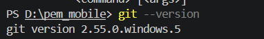
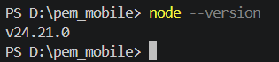
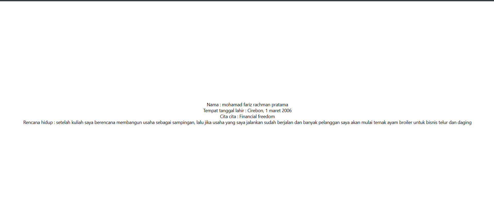

## **praktikum mentiapkan memulai pemrograman mobile dengan react native**

## **tujuan pembelajaran**
setelah menyelesaikan modul praktikum ini, mahasiswa diharapkan mampu 
-menginstall git dan github
-menginsstall node.js
-menginstall expo cli
-membuat project react native
-mennjalankan project react native

1.install Git di local
-unduh dan install git via https://git-scm.com/install/
-verifikasi git (buka cmd lalu ketik "git --version")

2.install node.js
-unduh dan install node js via https://nodejs.org/en/download
-verifikasi node js 

3.install expo CLI 
-buka terminal pada code editor
-ketik "npx create-expo-app ptmn2 --template blank"

