# laporan praktikum pemrograman mobile pertemuan 3 #

tujuan pembelajaran 
1. Memahami dan menggunakan **16 Core Components** React Native
2. Menerapkan **StyleSheet** untuk styling terpusat
3. Menggunakan **useState** untuk state management dasar
4. Membuat layout yang responsif dengan **Flexbox**
5. Menangani **interaksi pengguna** (tekan, input, scroll)

6. menyiapkan data dan array
7. konfirmasi bukti
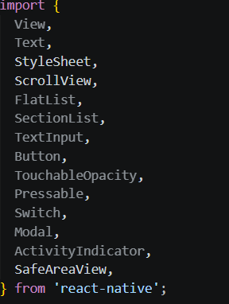

8. buat array profile
9. konfirmasi bukti
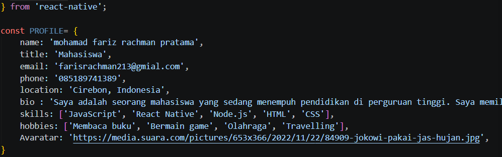

10. buat object skills
11. konfirmasi bukti 
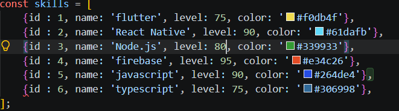

12. membuat object array section untuk menyimpan riwayat pekerjaan
13. konfirmasi bukti 
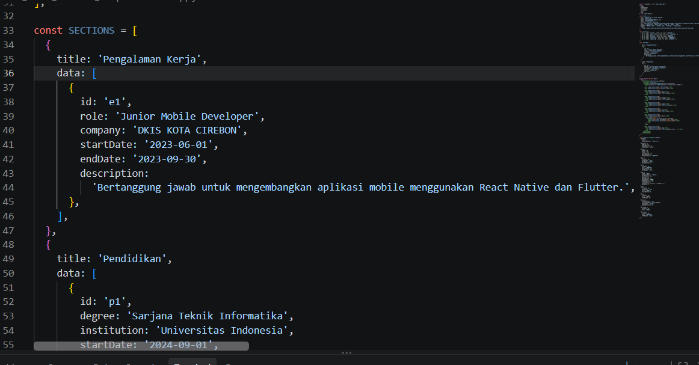

14. buat object array social
15. kunformasi bukti 
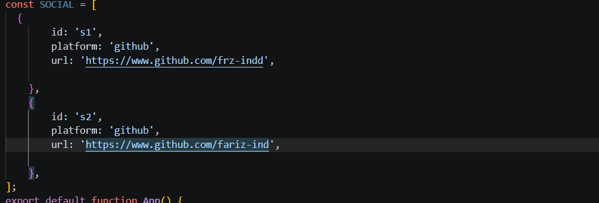
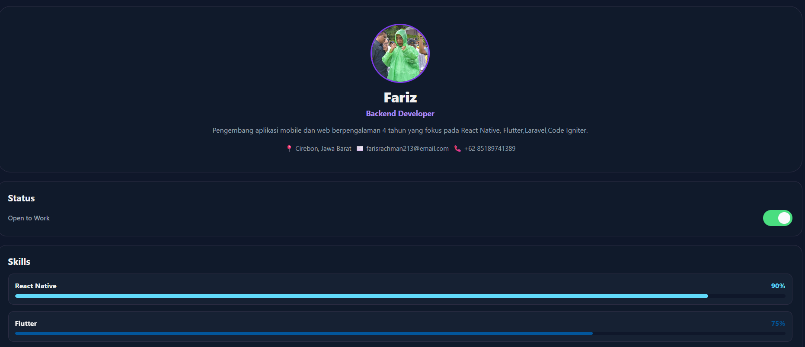
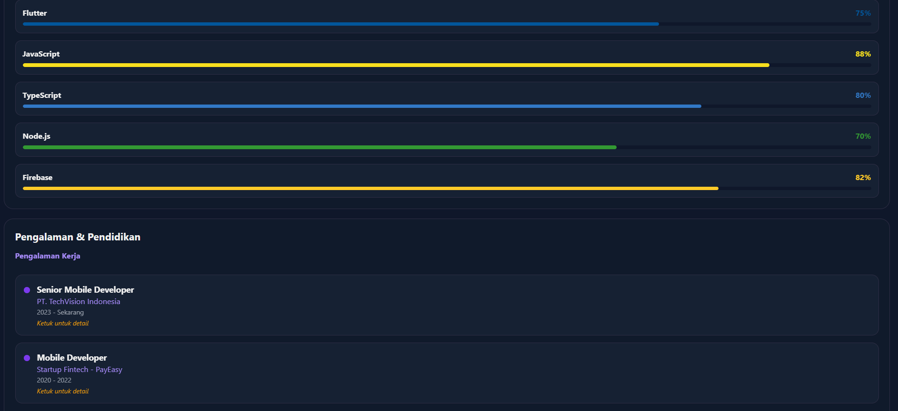
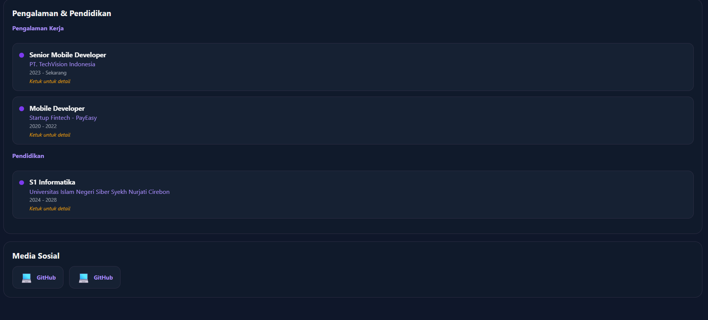
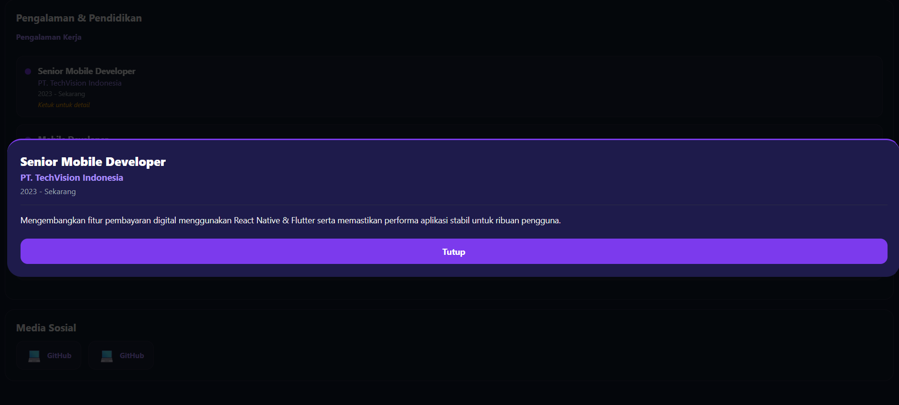
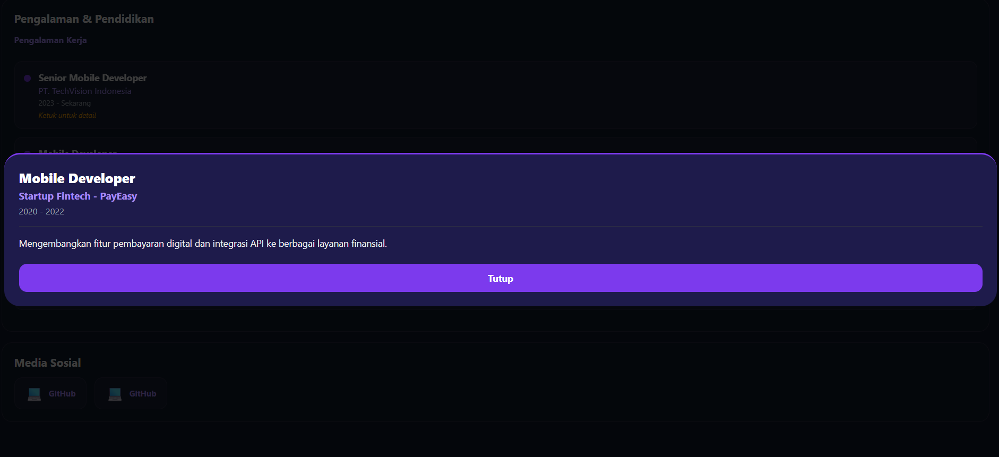
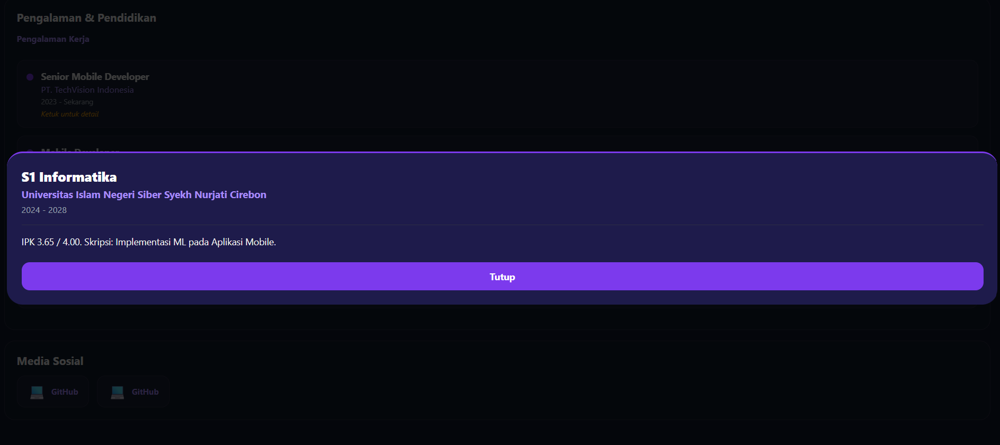
<video controls src="2026-09-24 08-17-33.mp4" title="Title"></video>